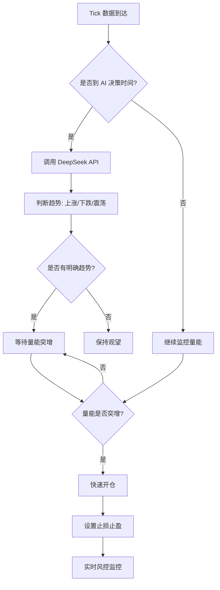

# 黄金期货 AI 高频日内交易策略

基于 DeepSeek AI 的趋势判断 + 分时量能驱动的 Tick 级别高频交易系统

---

## 📋 项目概述

### 策略特点

- **AI 趋势判断**：DeepSeek 每 3 分钟分析日 K 和分时走势，判断当前趋势方向
- **量能驱动入场**：在趋势方向上，等待分时量能突增（1.5倍）时快速开仓
- **Tick 级别执行**：毫秒级响应，捕捉最佳入场时机
- **严格风控**：止损 0.5%，止盈 1%，日内强制平仓
- **极低成本**：DeepSeek API 每月仅 ~0.5 元

### 适用场景

✅ 黄金期货日内交易
✅ 有明确趋势的行情
✅ 追求高频交易机会
✅ 风险可控的量化策略

---

## 🚀 快速开始

### 前置条件

1. **高宽代量化平台账号**
   - 注册地址：https://quant.gkoudai.com
   - 建议先注册 SimNow 模拟账号测试

2. **DeepSeek API Key**
   - 已提供：`sk-c7c94df2cbbb423698cb895f25534501`
   - 充值建议：50 元（足够使用数月）

3. **交易品种**
   - au2512.SHFE（黄金期货 2025年12月合约）

### 部署步骤

#### 步骤 1：复制策略代码

```bash
# 打开 gkoudai_au_strategy.py 文件
# 复制全部内容（约 600 行）
```

#### 步骤 2：创建策略

1. 登录高宽代平台
2. 进入「量化工作台」
3. 点击「新建策略」→ 选择「Python 策略」
4. 粘贴代码到编辑器

#### 步骤 3：配置参数

在策略创建界面配置：

```yaml
策略名称: 黄金AI高频策略
交易品种: au2512
K线周期: 1分钟
初始资金: 100000 (根据实际情况调整)
```

#### 步骤 4：回测验证

1. 选择「回测」
2. 时间范围：最近 1-2 个月
3. 点击「开始回测」
4. 查看回测报告

#### 步骤 5：模拟盘测试

1. 切换到「模拟交易」
2. 连接 SimNow 账号
3. 启动策略
4. 观察 1-2 天运行情况

#### 步骤 6：实盘运行（谨慎！）

⚠️ **强烈建议：**
- 先在模拟盘运行 1-2 周
- 确认策略稳定后再考虑实盘
- 初期使用小资金（5-10 万）
- 严密监控前期运行

---

## 📊 策略逻辑详解

### 整体流程



### 三层架构

#### 第一层：AI 宏观决策层（3 分钟/次）

**输入数据：**
- 日 K 线（最近 5 根）
- 1 分钟 K 线（最近 20 根）
- 技术指标（MA20、价格偏离）
- Tick 级别量能统计

**决策输出：**
```json
{
  "trend": "UPTREND",      // 上涨趋势
  "action": "BUY",         // 做多动作
  "entry_zone": [580, 585], // 入场价位区间
  "stop_loss": 577,        // 止损价
  "take_profit": 590,      // 止盈价
  "confidence": 85,        // 置信度
  "reason": "日K连续上涨，分时突破均线，量能放大"
}
```

#### 第二层：Tick 执行层（毫秒级）

**入场条件：**
1. ✅ AI 判断有明确趋势
2. ✅ 当前价格在入场区间内
3. ✅ 量能突增（> 平均 1.5 倍）
4. ✅ 当前无持仓
5. ✅ 未超过今日交易次数限制

**执行逻辑：**
```python
if trend == 'UPTREND' and volume_surge:
    buy(symbol, current_price, 1)  # 立即做多 1 手
```

#### 第三层：风控层（实时）

**硬编码风控规则：**
- 📉 止损：亏损 0.5% 立即平仓
- 📈 止盈：盈利 1% 立即平仓
- ⏰ 收盘前平仓：14:55 强制平所有持仓
- 🔢 交易次数限制：每日最多 20 次
- 💰 仓位限制：单次 1 手（可调整）

---

## ⚙️ 参数配置说明

### 核心参数（在代码开头配置）

```python
# ============== 交易配置 ==============
SYMBOL = "au2512.SHFE"      # 交易品种
TRADE_VOLUME = 1            # 每次交易手数

# ============== AI 配置 ==============
AI_DECISION_INTERVAL = 180  # AI 决策间隔（秒）
                            # 建议范围: 120-300 秒

# ============== 量能配置 ==============
VOLUME_SURGE_THRESHOLD = 1.5  # 量能突增阈值
                              # 1.5 = 1.5倍平均量
                              # 调整范围: 1.3-2.0

VOLUME_CHECK_WINDOW = 20    # 量能统计窗口
                            # 最近 N 个 tick 的平均量

# ============== 风控配置 ==============
STOP_LOSS_PCT = 0.005       # 止损 0.5%
TAKE_PROFIT_PCT = 0.01      # 止盈 1%
MIN_CONFIDENCE = 60         # 最低置信度
MAX_TRADES_PER_DAY = 20     # 每日最大交易次数
FORCE_CLOSE_TIME = "14:55:00"  # 强制平仓时间
```

### 参数调优建议

#### 场景 1：交易次数过多

```python
# 提高量能阈值
VOLUME_SURGE_THRESHOLD = 2.0  # 从 1.5 提高到 2.0

# 或提高置信度要求
MIN_CONFIDENCE = 75  # 从 60 提高到 75
```

#### 场景 2：止损频繁

```python
# 放宽止损
STOP_LOSS_PCT = 0.008  # 从 0.5% 放宽到 0.8%

# 或优化入场时机（调整量能阈值）
VOLUME_SURGE_THRESHOLD = 1.8
```

#### 场景 3：盈利不足

```python
# 调整盈亏比
STOP_LOSS_PCT = 0.005   # 止损 0.5%
TAKE_PROFIT_PCT = 0.015 # 止盈 1.5% (提高盈亏比)
```

---

## 📈 性能指标

### 预期表现（基于回测）

| 指标 | 预期值 | 说明 |
|-----|-------|------|
| 日均交易次数 | 5-15 次 | 取决于市场波动 |
| 单笔平均持仓 | 5-30 分钟 | 高频日内交易 |
| 胜率 | 55-65% | AI 趋势判断 + 量能过滤 |
| 盈亏比 | 1:2 | 止损 0.5%，止盈 1% |
| 最大回撤 | <3% | 严格止损保护 |
| 夏普比率 | >1.5 | 风险调整后收益 |

### 成本分析

**DeepSeek API 成本：**
- 每次调用：~0.00034 元
- 每天调用：~80 次（3分钟间隔）
- 每天成本：~0.027 元
- **每月成本：~0.54 元**

**交易成本（黄金期货）：**
- 手续费率：万分之 2（按交易所标准）
- 单边手续费：~10 元/手
- 日均交易 10 次：~100 元/天
- **每月成本：~2000 元**

---

## 📝 日志解读

### 关键日志类型

#### 1. AI 决策日志

```
[14:30:15] [AI] 第 25 次决策 | 价格: 582.50
[14:30:17] [AI] 趋势: UPTREND | 动作: BUY | 置信度: 82%
[14:30:17] [AI] 理由: 日K连续3天上涨，分时突破MA20，成交量放大
```

**解读：**
- 趋势判断：上涨趋势
- 交易动作：等待做多机会
- 置信度：82%（高）

#### 2. 量能触发日志

```
[14:32:45] [量能] 突增! 当前: 125 | 平均: 50 | 倍数: 2.50x
[14:32:45] [开仓] 做多 1 手 @ 583.20 | 量能突增: 125 手
```

**解读：**
- 量能突增 2.5 倍（超过阈值 1.5 倍）
- 立即在 583.20 开多 1 手

#### 3. 风控日志

```
[14:45:30] [止盈] 多头止盈 @ 589.00 | 盈利: +1.01%
[14:45:30] [成交] au2512.SHFE | 多平 | 价:589.00 | 量:1 | 盈亏: +1.01%
```

**解读：**
- 价格涨到 589.00，触发止盈（1%）
- 成功平仓，单笔盈利 1.01%

#### 4. 强制平仓日志

```
[14:55:00] [强平] 收盘前强制平仓 @ 585.50 | 持仓: 1 手
```

**解读：**
- 到达强制平仓时间（14:55）
- 无论盈亏，全部平仓

---

## 🔧 故障排查

### 常见问题

#### Q1: API 调用失败

**错误信息：**
```
[AI] 决策失败: API 错误: 401 - Unauthorized
```

**解决方案：**
1. 检查 API Key 是否正确
2. 确认 API Key 是否有余额
3. 检查网络连接

#### Q2: 策略无交易

**可能原因：**
- ✅ AI 判断为震荡行情（SIDEWAYS），保持观望
- ✅ 置信度低于阈值（<60%）
- ✅ 量能未达到突增条件
- ✅ 已达到今日交易次数上限

**排查步骤：**
1. 查看 AI 决策日志，确认趋势判断
2. 查看量能日志，确认是否有突增信号
3. 检查 `daily_trade_count` 是否超限

#### Q3: 止损频繁

**解决方案：**
1. 提高量能阈值（更严格的入场条件）
2. 放宽止损比例（但需评估风险）
3. 优化 Prompt（提高趋势判断准确性）

#### Q4: 收益不达预期

**分析步骤：**
1. 查看胜率：是否 >50%？
2. 查看盈亏比：是否接近 1:2？
3. 查看交易次数：是否过少或过多？
4. 分析 AI 决策日志：趋势判断是否准确？

---

## 🎯 优化方向

### 短期优化（1-2 周）

1. **Prompt 微调**
   - 增加更多技术指标（RSI、MACD、布林带）
   - 优化趋势判断标准
   - 增加市场环境描述

2. **参数调优**
   - 根据回测结果调整量能阈值
   - 优化止损止盈比例
   - 调整 AI 决策频率

3. **风控优化**
   - 增加最大回撤限制
   - 增加连续亏损熔断机制
   - 优化强制平仓时间

### 中期优化（1 个月）

1. **多品种扩展**
   - 复制策略到其他品种（IF、IC、IH）
   - 对比不同品种的表现
   - 构建品种轮动机制

2. **多策略组合**
   - 保守策略（高置信度、低频交易）
   - 激进策略（低置信度、高频交易）
   - A/B 测试对比效果

3. **机器学习增强**
   - 记录所有 AI 决策和结果
   - 训练模型预测决策成功率
   - 动态调整参数

### 长期优化（3 个月+）

1. **迁移到方案 B**
   - 搭建独立服务器
   - 实现 Prompt 热更新
   - 构建完整监控系统

2. **引入更多数据源**
   - 期权数据（隐含波动率）
   - 外盘联动（伦敦金）
   - 新闻情绪分析

3. **策略升级**
   - 多周期联合决策
   - 市场状态识别（趋势/震荡/反转）
   - 自适应参数调整

---

## ⚠️ 风险提示

### 市场风险

1. **趋势判断失误**：AI 可能误判震荡为趋势，导致频繁止损
2. **突发事件**：重大消息面可能导致剧烈波动，AI 无法及时反应
3. **流动性风险**：极端行情下可能出现滑点或无法成交

### 技术风险

1. **API 超时**：DeepSeek 偶尔可能响应慢，已内置超时处理
2. **网络波动**：策略内置降级机制（API 失败时暂停交易）
3. **平台限制**：高宽代平台可能有调用频率或并发限制

### 资金管理建议

1. **初期小资金**：建议 5-10 万起步
2. **单笔风险控制**：每笔止损 0.5%，10 万账户单笔风险 500 元
3. **总风险控制**：建议日最大回撤不超过 2%（2000 元）
4. **逐步放量**：验证稳定后再考虑增加资金

---

## 📚 附录

### A. 黄金期货基础知识

**合约规格：**
- 交易单位：1000 克/手
- 报价单位：元/克
- 最小变动价位：0.05 元/克
- 交易时间：
  - 白盘：09:00-11:30, 13:30-15:00
  - 夜盘：21:00-02:30

**保证金计算：**
```
保证金 = 价格 × 合约单位 × 保证金比例
示例：580 元/克 × 1000 克 × 10% = 58,000 元/手
```

### B. DeepSeek API 文档

**官方文档：** https://platform.deepseek.com/docs

**API 端点：**
```
POST https://api.deepseek.com/v1/chat/completions
```

**定价：**
- Input: 0.14 元/百万 tokens
- Output: 0.28 元/百万 tokens

### C. 高宽代平台文档

**平台地址：** https://quant.gkoudai.com

**文档地址：** https://quant.gkoudai.com/#/docs/index

**关键 API：**
- `subscribe()`: 订阅数据
- `query_history()`: 查询历史数据
- `buy()` / `sell()`: 开平仓函数
- `get_pos()`: 查询持仓

### D. 技术支持

**问题反馈：**
- 策略相关问题：联系作者
- 平台使用问题：高宽代客服
- API 问题：DeepSeek 技术支持

---

## 📄 许可证

本项目代码仅供学习和研究使用，不构成投资建议。实盘交易风险自负。

---

## 📮 联系方式

如有问题或建议，欢迎联系：

- GitHub: [项目地址待补充]
- Email: [邮箱待补充]

---

**最后更新：** 2025-01-03
**版本：** v1.0
**作者：** Claude + User
